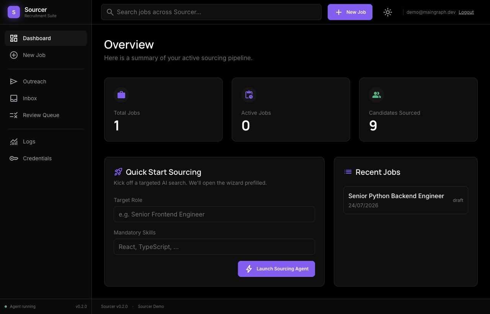
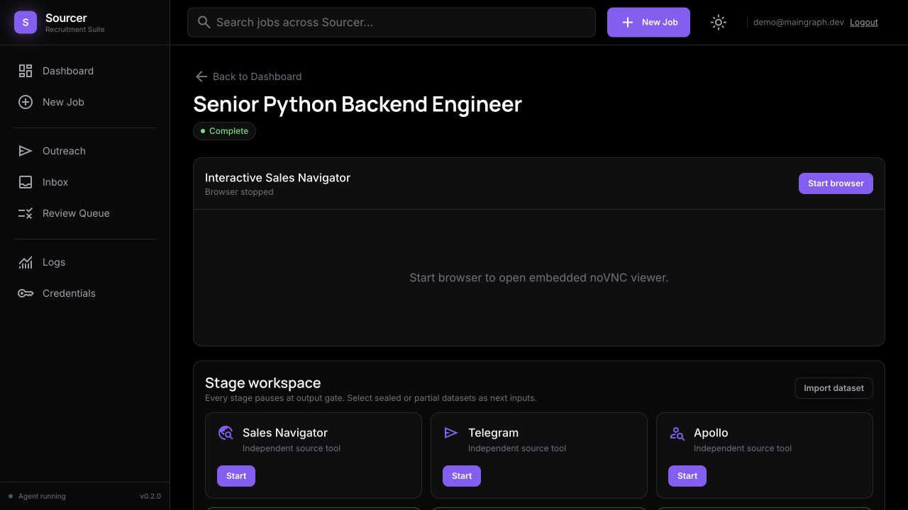
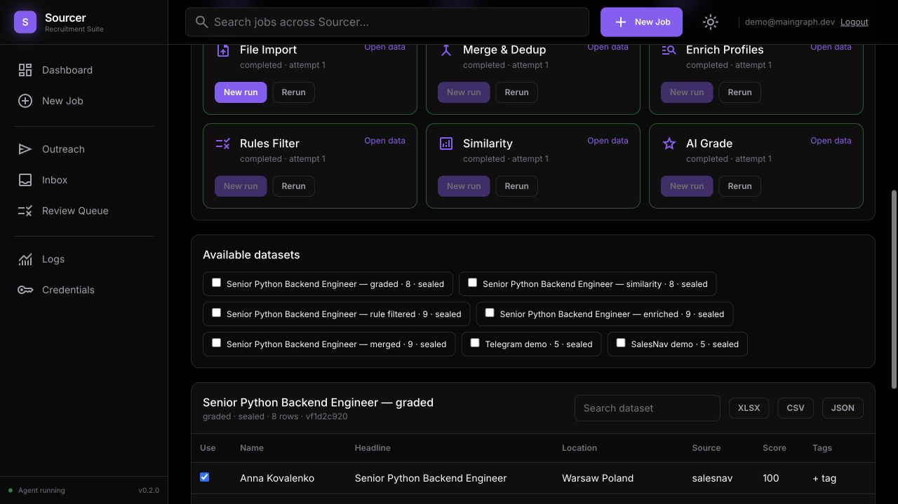
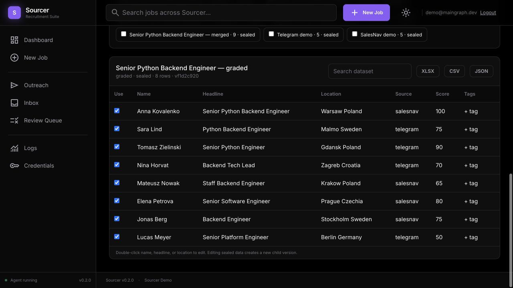

# Sourcer: состояние продукта и демо

## Что уже работает

Sourcer собран как единая локальная платформа для рекрутера. Процесс разделен на независимые этапы, и результат каждого этапа сохраняется как отдельная версия датасета. Рекрутер может остановиться, проверить и поправить данные, экспортировать их, заменить импортом, продолжить или запустить этап заново.

Проверенный сценарий:

1. Импорт кандидатов из независимых источников.
2. Явное объединение и удаление дублей.
3. Обогащение существующими данными или внешним провайдером.
4. Фильтрация по правилам без потери истории.
5. Анализ похожести.
6. AI-оценка и сортировка кандидатов.
7. Экспорт результата в XLSX, CSV или lossless JSON.

## Проверенный результат

- Два независимых источника: Sales Navigator и Telegram.
- 10 исходных строк.
- 9 уникальных кандидатов после Merge & Dedup.
- 8 кандидатов передано в AI Grade после управляемого исключения.
- Финальные оценки от 50 до 100.
- JSON, CSV и XLSX проходят экспорт и обратный импорт.
- Все промежуточные датасеты сохранены и доступны отдельно.

## Наблюдаемый и управляемый pipeline

Sales Navigator открывается прямо внутри страницы вакансии в отдельном Chromium. Пользователь может вручную войти в LinkedIn, поменять фильтры, зафиксировать точный поиск, запустить сбор, поставить его на паузу, забрать управление браузером и сохранить частичный результат.

Каждый этап имеет собственные входы, выходной датасет, статус и команды. Продолжение запечатывает текущую версию; редактирование создает новую дочернюю версию и не портит историю.

## Доказательство выполнения этапов

На демо-вакансии фактически выполнены File Import, Merge & Dedup, Enrich Profiles, Rules Filter, Similarity и AI Grade. Это не статический макет: строки, счетчики, версии и оценки получены через backend и локальную PostgreSQL.

## Текущая готовность

Готово для пилота:

- единый Docker-запуск на Mac;
- локальная PostgreSQL без зависимости от старого Supabase;
- аутентификация, версии датасетов и история этапов;
- безопасные Pause, Resume, Stop, Rerun и частичный экспорт;
- встроенный браузер с постоянным профилем;
- дешевый AI-провайдер через Google Gemini;
- единый web-gateway для HTTPS-размещения.

Ограничения пилота:

- LinkedIn-вход выполняется пользователем вручную;
- реальный Sales Navigator extraction нужно проверить на текущей верстке LinkedIn;
- публичный адрес на первом пилоте зависит от работающего Mac, пока проект не перенесен на постоянный сервер;
- outreach остается отдельным модулем и не входит в текущую демонстрацию sourcing pipeline.

## Предлагаемый пилот

Дать доступ одному рекрутеру, провести одну реальную вакансию от поиска до выгрузки shortlist и зафиксировать:

- время до первых релевантных кандидатов;
- число найденных и уникальных профилей;
- долю кандидатов, прошедших фильтры;
- качество top-10 после AI Grade;
- ручное время рекрутера на каждом этапе.

После одного успешного закрытого пилота продукт можно предлагать компании как подписку на рекрутера с отдельной оплатой AI и enrichment usage.
